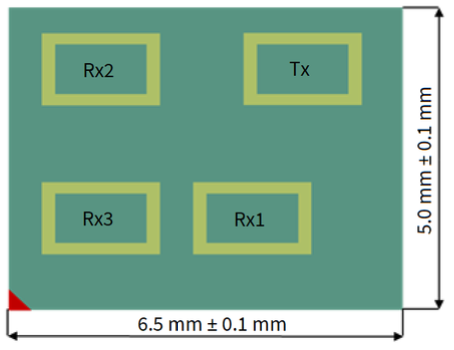
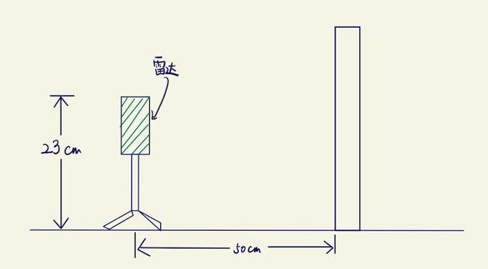
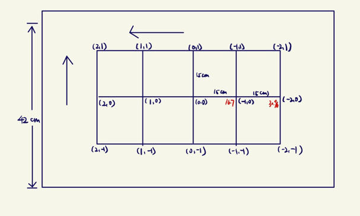
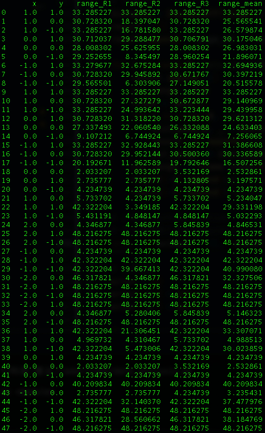

# 单目雷达定位结果分析

### 设备说明

做实验时，雷达天线排布如图所示

- 有一个发射天线和三个接收天线
  - 计算azimuth，使用（R3，R1）
  - 计算elevation，使用（R3，R2）
  - 计算range，三个接收天线分别计算

### 实验环境

**设备放置**

**被检测物品**

- 第一视角：手掌
- 8cm*8cm，被锡纸包裹的纸板

| 物品   | 距离（cm） | 数据  |
| ------ | ---------- | ----- |
| 手掌   | 40         | 1-18  |
| 锡纸板 | 50         | 19-48 |

### 结果分析

#### 距离

下图不同组实验的均方根误差

- 第一视角，进行手掌定位的实验时，由于手臂存在遮挡，导致距离误差较大，距离被检测为10-20cm左右。（1-18）

- 进行锡纸板定位的实验时，
  - 由于不存在遮挡，并且金属对信号的反射性能好，结果误差较小。
  - 但仍然存在结果不准的情况
    - 受到FOV的限制，当锡纸板的坐标处于中心位置的时候，误差较小（18-21,23,24,27,37,39-41,43）
    - R2接收天线效果要略好于R1和R3接收天线。（22,30,38）
    - 环境中的信号
    - 板子本身存在问题（再进行一次实验）

#### azimuth

#### elevation

#### 空间坐标误差
